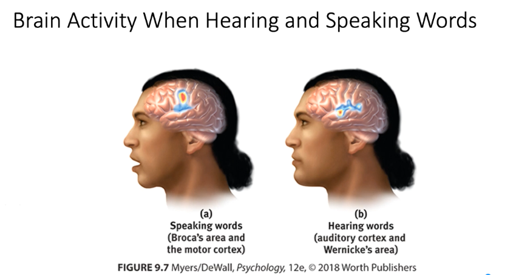

# Aphasia

The loss or impairment of speech, usually cased by left hemisphere damage either to [[brocas-area]](impairing speaking) or to [[wernickes-area]](impairing understanding)

[//begin]: # "Autogenerated link references for markdown compatibility"
[brocas-area]: brocas-area "Broca's Area"
[wernickes-area]: wernickes-area "Wernicke's Area"
[//end]: # "Autogenerated link references"