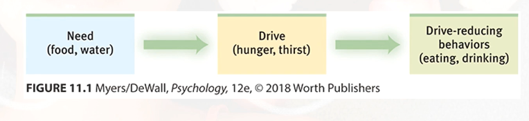

# Drive Reduction Theory

Drive reduction theory suggests physiological need creates an aroused tension state (a drive) that motivates an organism to satisfy that need. When you are hungry you want food.

[[Homeostasis]] is the tendency to maintain a balanced or constant internal state; it involves the regulation of any aspect of body chemistry.

[[Incentive]] involves a positive or negative environmental stimulus that motivates behavior

[//begin]: # "Autogenerated link references for markdown compatibility"
[Homeostasis]: homeostasis "Homeostasis"
[Incentive]: incentive "Incentive"
[//end]: # "Autogenerated link references"