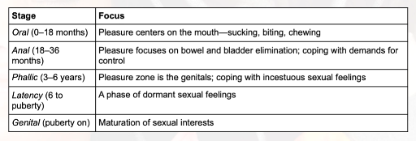

# Freud's Psychosexual Stages

Weakest part of [[Freud]]'s theory. Kind of disproven. He was kind of a weirdo!

[//begin]: # "Autogenerated link references for markdown compatibility"
[Freud]: freud "Sigmund Freud (1856 - 1939)"
[//end]: # "Autogenerated link references"