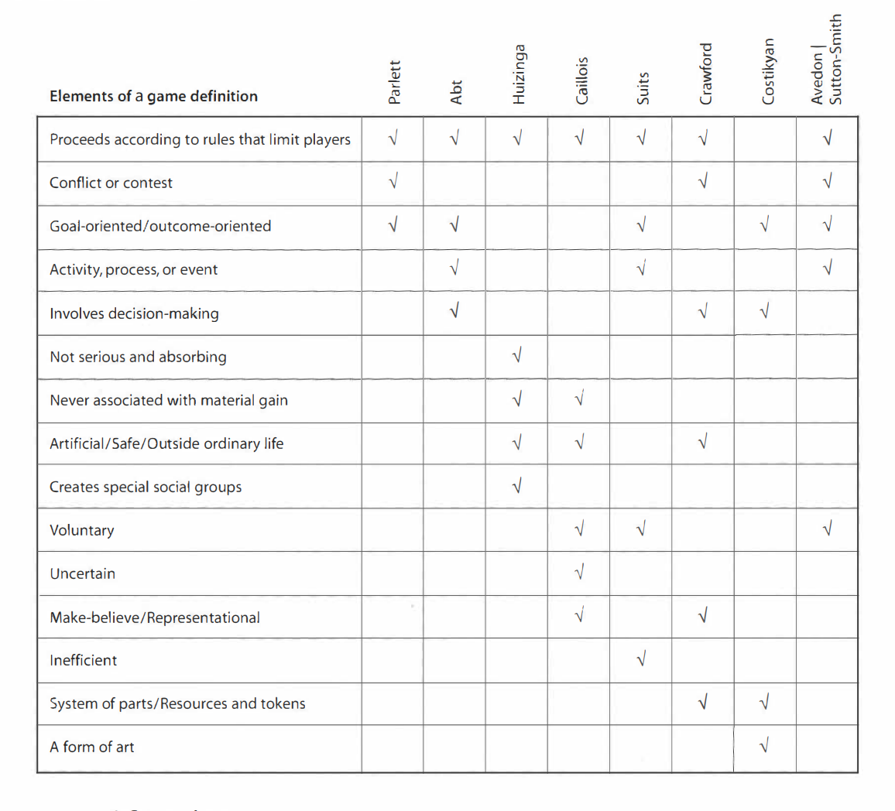

# iat-210-defining-games

Two relationships: Games could be considered a subset of play or play could be considered a subset of games

## Definitions

### David Parlett

* There are informal games (play) and formal games (games as we think of)
* A formal game has a twofold structure based on ends and mens
* Ends: the goal of the game, how many people can win, how do they win?
* Means: an agreed upon set of equipment/rules by which players may play and perhaps reach the end.

### Clark C. Abt

* A game is an activity among two or more independent decision makers seeking to achieve their objectives in some limiting context
* Activity: a game is an activity, a process, an event
* Decision makers: games require players that actively make decisions
* Objectives: games have goals
* Limiting context: rules, etc
* Politics, business, etc, are all games in a sense

### Johann Huizinga 

* Play is a free activity outside of normal activity. With no real life consequences yet still immersing the player intensely.
* Has it's own time/space according to fixed rules. Orderly manner.
* Promotes the formation of social groupings that separate from the outside world.
* Not associated with profit.

### Roger Caillois

* A game is not obligatory to play. Otherwise it would lose fun.
* Separate as above
* Uncertain - cannot be determined who wins at the start. Up to the players.
* Unproductive - creates no wealth or goods. All lives outside the game reamin the same.
* Governed by rules
* Make-believe

### Bernard Suits

* Playing a game is a voluntary effort to overcome unnecessary obstacles.
* A specific state of affairs - games have a goal
* The rules of the game limit behavior, making it less efficient 
* This is called a lusory attitude. The willingness to do less efficient things for the sake of the game (Ex: could cheat but it would make it less fun, cutting to the finish line runner)
* Rules are accepted

### Chris Crawford

* Four qualities that define games:
* Representation - a **closed** FORMAL system represents reality
* Interaction - is interactive
* Conflict - must have a conflict (not necessarily violence)
* Safety - a game is a safe way to explore different realities/situations

### Greg Costikyan 

* "A game is a form of art in which participants, termed players, make decisions in order to manage resources through game tokens in the pursuit of a goal"
* Game tokens - the means by which players enact their decisions
* Games are art

### Elliot Avedon and Brian Sutton-Smith 

* "Games are an exercise of voluntary control systems, in which there is a contest between powers, confined by rules in order to produce a disequilibrial outcome."

### Textbook Definition

"A game is a system in which players engage in an artificial conflict, defined by rules, that results in a quantifiable outcome."

---

---

Are puzzles games? Textbook says yes. Though they may be a special subset. This is because they can be "solved".

RPGs are also interesting as they do not have a specified goal in some contexts. Also with sim games. Players make the goals!