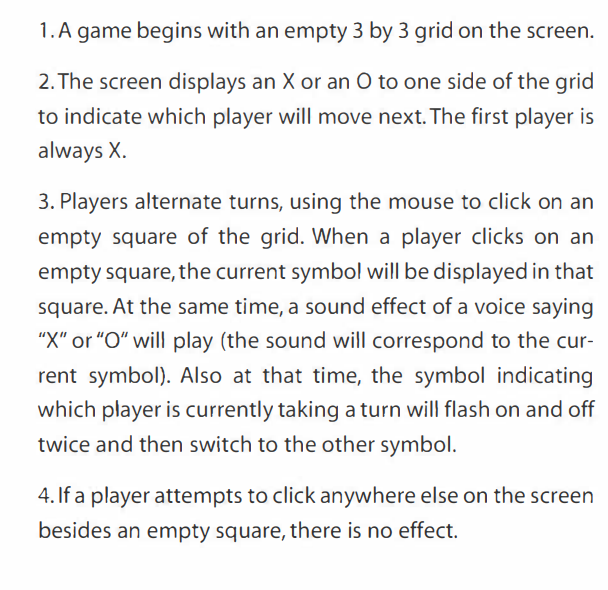
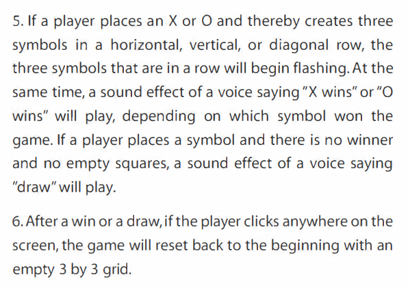

# iat-210-digital-games-meaningful-play

# Digital Games

If a game is a system then its medium does not define the whole game. We cannot define digital games solely as being digital.

## Four elements of a system

1. Objects
2. Attributes 
3. Relationships 
4. Environment

## Four traits of digital media

1. ### Immediate but narrow interactivity
   1. Looks pretty, changes immediately, but ultimately is shallow as you are constrained by the computer and what the programmers programed. Only mouse and keyboard input, screen/speaker output.
   2. Can also be helpful - need to memorize combos in fighting games. Structure in limitation.
2. ### Information Manipulation
   1. You can obfuscate why something happens. Makes possible to learn the rules as you play the game. Fog of war.
   2. Physical games can also manipulate information - memory games
3. ### Automated Complex Systems
   1. Large games would be impossible to simulate. Giant strategy. Computers speed up.
   2. Black Box Syndrome - Computers don't reveal their inner workings. Where as you can learn the ins and outs of a physical system much easier. You know why things are happening.
   3. Pachinko is an example of a automated complex system in the physical world. Uses gravity and physics as its engine.
4. ### Networked Communication
   1. Long distance communication between players easy. Even two link cables on a GB is also networked communication though. High score boards.
   2. Real life version: snail mail chess. Sports records real life score board.

# The Rules of Digital Games

The code of a program is not the the same thing as its rules.

To decide if something is a rule, ask yourself how the game would change if it was changed? What if in tetris the pieces weren't random but on a cycle?

Sound effects and music or special effects maybe be programmed, BUT THEY ARE NOT RULES!

If the sound effects or special effects gave hints or clues, or impacted game play directly. They could be considered rules. "Only move when the cactus emits sparkly particles".

## Constitutive Rules

Constitutive rules are like rules of systems without interactivity. Foundational systemic rules. Example of Tic Tac Toe:

    1. Two players alternate making selections on a 3x3 grid
    2. First player to get 3 in a row wins
    3. If no player can move there is a draw

## Operational Rules

How to play and with interaction. Do not include aesthetic. Describe systems and result of interacting with systems.




## Implicit Rules

"Obvious" things that you wouldn't think you would need to state.

"If you move your mouse the mouse on the screen moves"

"The game doesn't have any effect on anything on your computer outside of it"

"You may delete the program"

or a real life example: "You have to take your turn in a reasonable amount of time"

---

# Meaningful Play

The goal of successful game design in the creation of **MEANINGFUL PLAY**!

Examples of meaningful play:

* The intellectual dueling of two players in chess
* The improvisation in basketball
* Dynamic shifting of roles in WOW guilds
* The lifestyle invading of assassin played on a college campus

When play becomes real, the stakes are real, the magic circle is crossed, you are immersed in the game. It has meaning to you. You are invested.

It emerges from the interaction between players, systems, each other. As well as context.

Textbook definition:

```
Meaningful play in a game emerges from the relationship between
player action and system outcome; it is the process by which a
player takes action within the designed system of a game and the
system responds to the action. The meaning of an action in a game
resides in the relationship between action and outcome.
```

```
Meaningful play occurs when the relationships between actions
and outcomes in a game are both discernable and integrated into
the larger context of the game. Creating meaningful play is the
goal of successful game design. 
```

Discernable means the result of an action is communicated to the player in a clear way.

Integrated means a players actions not only have immediate effect, but also have an effect later in the game. The systems are working together.

```
Whereas discernability of game events tells players what happened (I hit the monster), integration lets players know how it
will affect the rest of the game (If I keep on hitting the monster I
will kill it. If I kill enough monsters, I'll gain a level.). Every action
a player takes is woven into the larger fabric of the overall
game experience: this is how the play of a game becomes truly
meaningful. 
```

