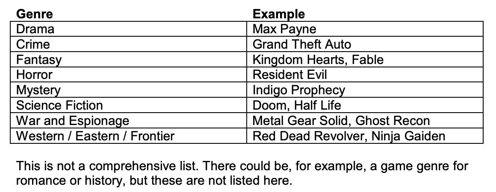

# iat-210-type-vs-genre

A game type is like Action, Simulation, Strategy, etc.

A game genre describes the way a story is told. They roughly are like film genres.

Games may have multiple genres/types. GTA could be roleplaying crime action simulation adventure.