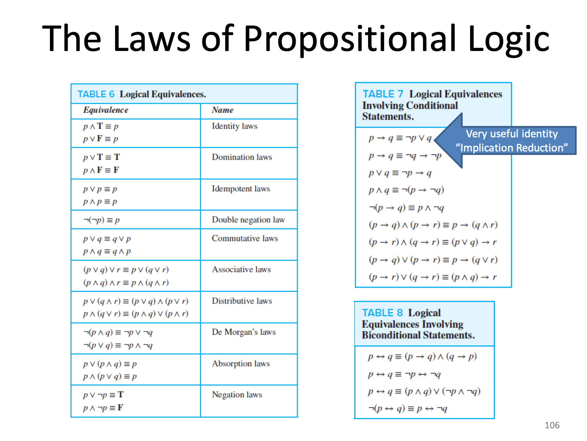

# macm-101-lecture-2

* Theory - set of laws and axioms
* Induction -> Theory -> Deduction ->
* Axioms - special set of propositions that require no proof. Solid starting point.
* Truth Value: Being truth or false but not both
* Proposition: a declarative sentence that possesses truth value
* Remark: use lowercase to denote statements that cannot be broken down further 
* A proposition cannot have a variable!
* Literal - a proposition or its negation

---

## Tricky Words 🥴

Sufficient p -> q |  ```p is sufficient for q```

Necessary p -> q |   ```q is necessary for p```

---

Converse is when you switch p & q remember with CONVERSE SNEAKERS WORN ON DIFFERENT FEET

---



--- 

Always false then vacuously true

Always true then trivially true

---

Tautology a compound statement that is true for all its component statements (Always true on a truth table)

Contradiction: the opposite of a tautology (always false)

Satisfiability - that it can be made true by at least one case

---

## Normal Forms

Breaking something down to just NOT, AND, and OR. 

CNF = conjunction normal form

Just breaking down all the statements into base components

---

Disjunction - OR of clauses

Conjunction - AND of clauses

There are disjunctive and conjunctive forms. Where they are primarily made up of OR, AND respectively.

---


