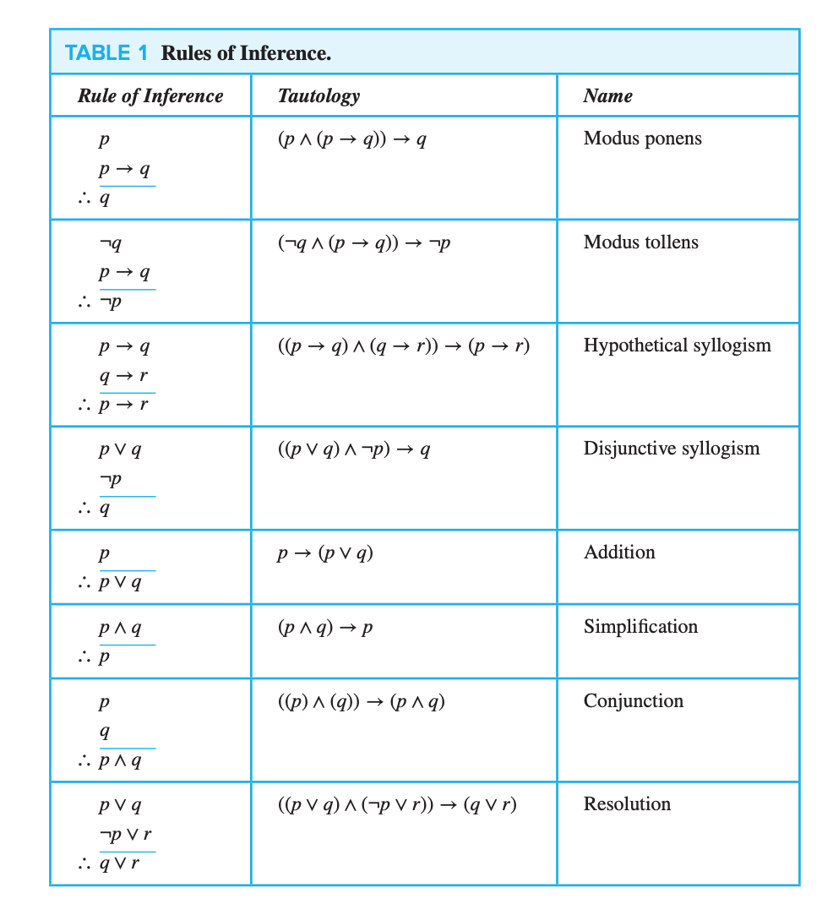

# macm-101-lecture-3

A deductive argument proves its conclusion ONLY if it is both **valid** and **sound**.

An argument is valid when, IF all of it's premises were true, then the conclusion would also have to be true. 

In other words a valid argument is one where the conclusion necessarily follows from the premises. It is IMPOSSIBLE for the conclusion to be false if the premises are true.

--- 

* One cannot construct a logical argument with statistical arguments. 

* Truth is predicated on propositions which are either true or false.

* Deductive arguments are predicted on premises which are either valid or invalid.

* A deductive argument is valid iff it takes a form that makes it impossible for the premises to be true and the conclusion nevertheless to false otherwise a deductive argument is said to be invalid (can't have T -> F). 

* If an argument is valid and all premises are true, then it is sound.

* A valid argument can have one or more false premises if we ignore soundness.

# Rules of Inference

