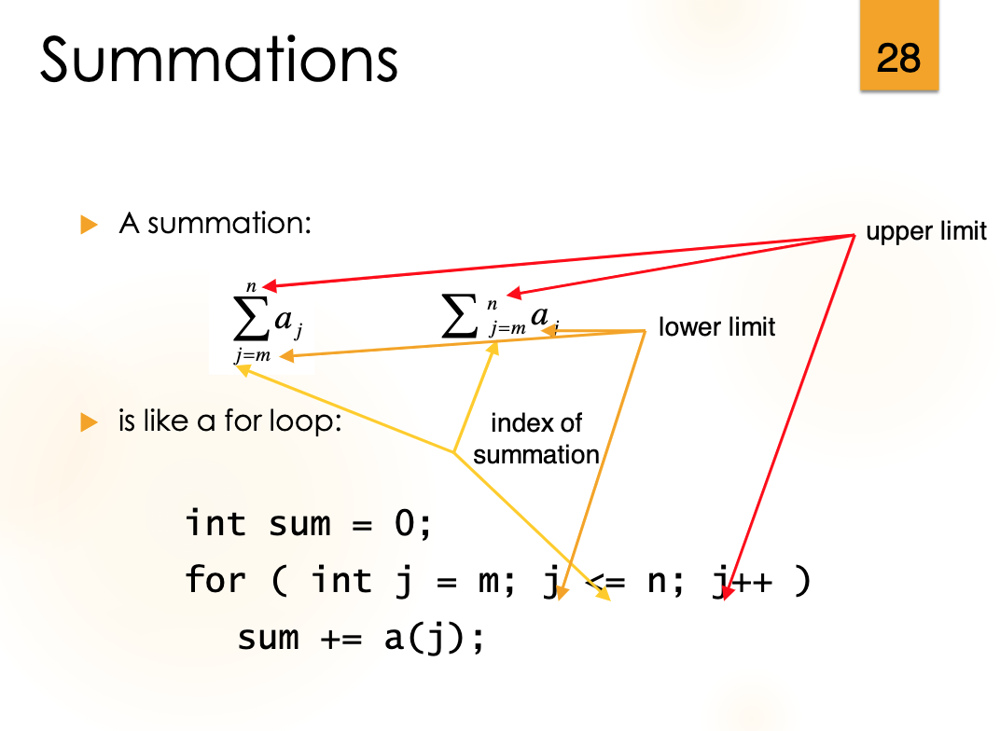
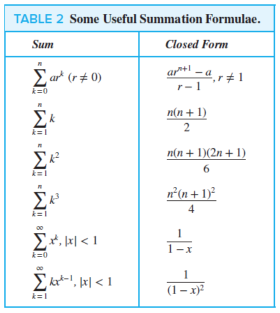

# macm-101-sequences-and-summations

# Sequences

A sequence is a function from a subset of integers to a set S. 

Example a<sub>n</sub> = 1/n

would be 1, 1/2, 1/3, 1/4 ...

--- 

## Common Sequences 

Geometric Progression = ```a, ar, ar^2, ..., ar^n```

Arithmetic Progression = ```a, a+d, a+2d, ..., a+nd```

---

Fibonacci Sequence = F(n-1) + F(n-1), F(1) = F(2) = 1

F(n) = ```( (1+sqrt(5))^n - (1-sqrt(5))^n ) / ( sqrt(5) * 2^n )```

---

## Recurrence Relation

A recurrence relation is a an equation that expresses itself in terms of itself, recursion. The initial conditions for a sequence specify the terms that preclude the first term where the recurrence relation takes effect (ie base cases).

Closed formula - the a formula for the nth term of a recurrence relation

---

# Summations



