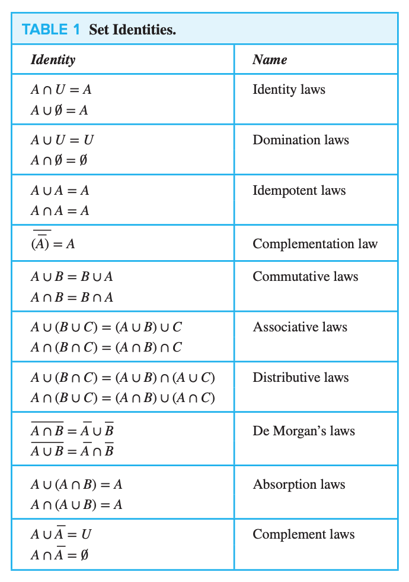
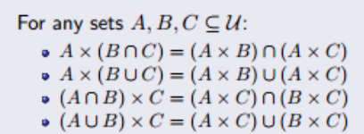
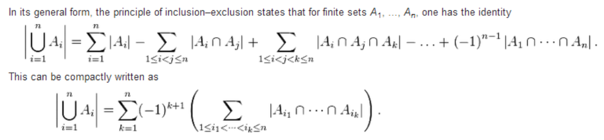

# macm-101-set-theory-2-operations-functions

# Operations on Sets

## Union
* The 'or' of the set world
* Denoted with '∪'
* ex: {1,2,3} ∪ {3,4,5} = {1,2,3,4,5}

## Intersection
* The 'and' of the set world
* Denoted with '∩'
* ex: {1,2,3} ∩ {3,4,5} = {3}

## Set Difference
* The members of the left set which are not members of the right
* Denoted with '\'
* ex: {1,2,3} \ {3,4,5} = {1,2}
* ex: {3,4,5} \ {1,2,3} = {4,5}

## Symmetric Difference
* The XOR of the set world.
* Denoted with '△'
* ex: {1,2,3} △ {3,4,5} = {1,2,4,5}

# Cartestian Products

Let A and B be sets. The cartesian product is the set of all ordered pairs (a, b) where a is a member of A and be is a member of B.

Example: {1,2} X {a,b,c} = {(1,a), (1,b), (1,c), (2,a), (2,b), (2,c)}

CP of empty set X any set = empty set

CP of set times itself order doesn't matter

Cartesian operations cheat sheet;

---

# Principle of Inclusion/Exclusion

To calculate the cardinality of a union, you should add together the cardinality of the individual sets and subtract the cardinality of the intersection of the sets.

---

# Functions

REMEMBER THESE ARE DISCRETE BRO

A function is continuous if its entire domain, or intervals within its domain, are defined on the set of real numbers.

A function is discrete if its domain and range are discrete values.

An analytic function is a function that is locally given by a convergent power series.

A function is elementary if it is built from basic operations. This includes algebraic functions, which can be expressed as the solution of a polynomial equation with integer coefficients.

Transcendental functions are elementary functions that are not algebraic.

## What is a 'Relation'?

Based off a cartesian product, a relation is a subset of a cartesian product. Including the whole cartesian product.

A function is a special type of relation. A function relation can only have unique a values in (a,b) tuple pairs.

f: A -> B

## Types of Functions

### Injective / One-to-one function

* Each b value is only mapped to once. 

### Surjective / Onto function

* Each b value is mapped to at least once.

### Bijective / One-to-One Correspondence

* It is both injective and surjective.
* Each b value is mapped to and each b value is mapped to only once.

# Invertability

A function can only be invertible if it is bijective.
