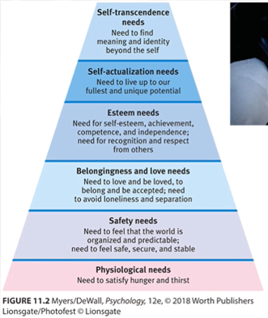

# Maslow's Hierarchy of Needs

Created by [[Abraham Maslow]] in the 1960s to view human motives as a pyramid. Lower level needs must be met to satisfy higher level needs. Lowest level are base needs while higher level are more abstract. 

[//begin]: # "Autogenerated link references for markdown compatibility"
[Abraham Maslow]: abraham-maslow "Abraham Maslow"
[//end]: # "Autogenerated link references"