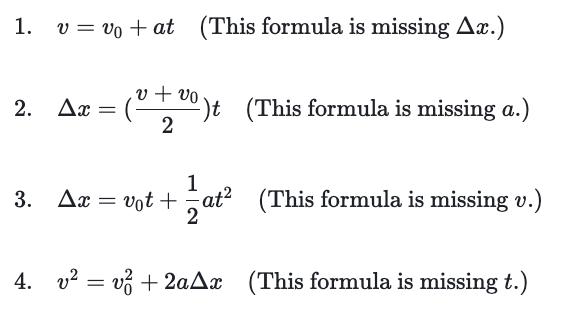
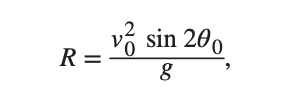
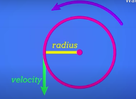
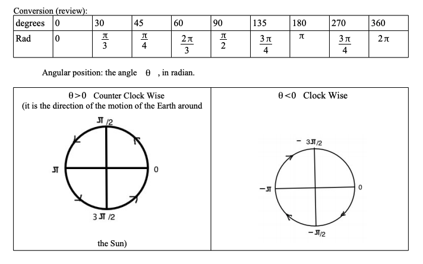
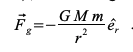

Things to Remember
* Displacement is not distance! Displacement is final distance travelled! You could go to New York and back but your displacement would be 0.
* Make sure you do not include unnecessary forces in a free body diagram. Only forces that affect the current system.

# Physics 1118 Formula Sheet

Velocity:
>ΔV = Δx / Δt

Acceleration:
>a = Δv / Δt

Definition of Acceleration: 
>ΔV = v0 + a t

The Displacement Curve: 
>x - x0 = v0t + ½ . a . t2

Kinematic Formulas from Khan Academy:

Range Formula (to get horizontal distance a projectile can travel):

picture from textbook

>Where R is distanced travelled horizontally, v02 is initial velocity (total, not x/y components) multiplied by sin2θ all over g. This means to find angle, you need to input g then multiply equation by g. Then plug in initial velocity and square it. Then divide equation by that squared velocity. Then get the inverse sin of that number and divide it by 2 to get the original angle. **IMPORTANT NOTE: THIS CAN ONLY BE USED WHEN Δy = 0**

> To find another angle with the same result, take 90 - angle you got. For example 90-20=60, so 20 and 60 degrees should give teh same result for range.

## Forces

Force:

> F = ma

Weight/Gravitational Force:

>Fg = mg

The unit for force is Newtons (N) or (kg * m) / s2

Static (Needed to Get Moving) Friction:
>fs(max) = μsN

Where N is usually weight

Kinematic (Moving) Friction:
>fk = μkN

## Centripetal Force

T = period of motion (how long it takes to get to the same spot in the circle).

f (frequency) = how many revolutions per second = 1/T Hz (hertz)

Circumference = c = 2π * Radius

ωz = constant angular velocity

d (diameter) = 2r

Constant Angular Velocity Finder:
> θ(t)=ωz * t+θ0
 

Revolutions to Radians:
> 2πrad / rev

Change in angle formula (θ in radians):

> Δθ = Δs / r (Δs = change in arc length = distanced travelled in circle)

How Velocity Acts in Circular Motion:

Velocity Equation for Uniform Circular Motion:
> v = 2πr / T = Circumference / Period

(Magnitude of Centripetal) Acceleration 
> a = v2 / r

Get Angle at Time (θ in radians):
> θ = (-π/30 * t) + (π/2)

Angles Chart:

Force of Gravity:
