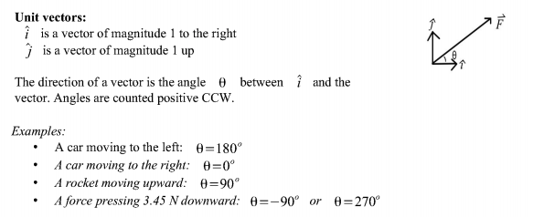
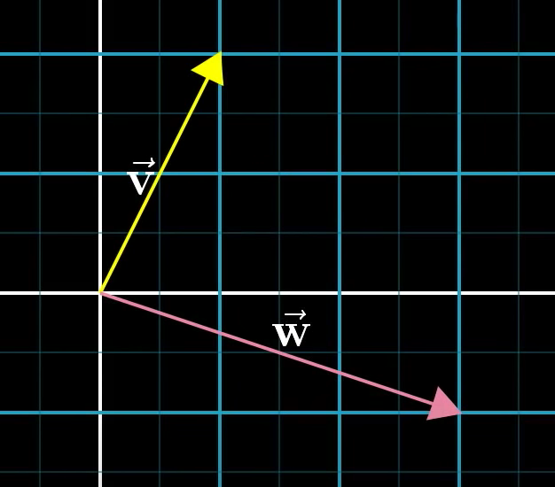
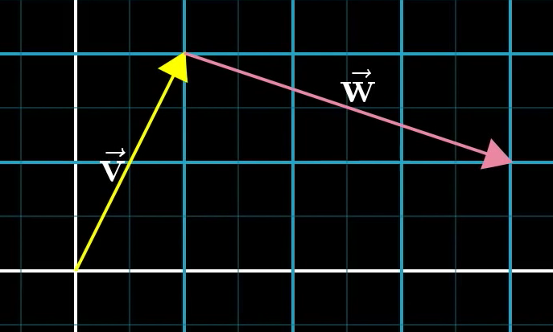
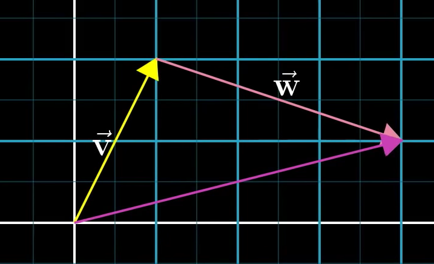
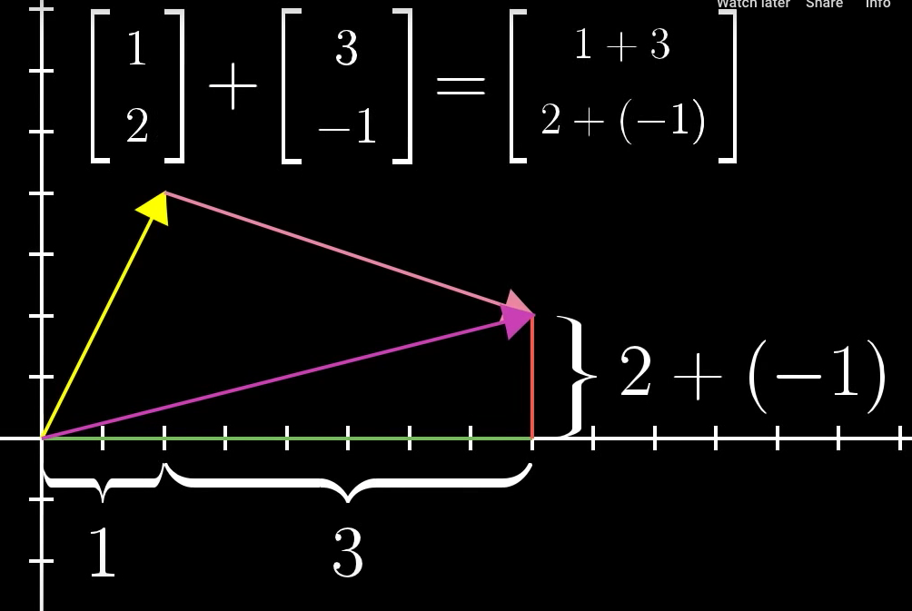

# Physics 1118 Lecture 2 Notes

[[Vectors]]

A magnitude of a vector is a number with a unit. Magnitude has no direction so it has no +/- sign.

Ex: A sword flying towards your head at 60 m/s to the left: magnitude is 60 m/s. Even though it is to the left and so may be seen at - it is not because it is just magnitude.

Unit Vectors

## Adding Vectors

Start with two vectors

Put them "tip to tail"

The resulting drawn vector is the sum of both added

Example with numbers:

## Multiplying Vectors

If you multiply a vector, if > 0 you are stretching if >1 or squashing if < 1.

If you have a negative [scalar](scalar.md), it means the vector is flipped and then squashed or stretched.

The official term for this is called scaling.

## Matrix Form

Vectors in physics are often "stacked" into matrix form, with two square brackets. The x axis being on top and the y axis being on the bottom. A positive x is to the right and a positive y is upwards. 

[x/y]

## Finding X and Y magnitudes from Vector and Angle

To find X: Vector Total * cos(angle)

To find y: Vector Total * sin(angle)

[//begin]: # "Autogenerated link references for markdown compatibility"
[Vectors]: vectors "Vectors"
[//end]: # "Autogenerated link references"