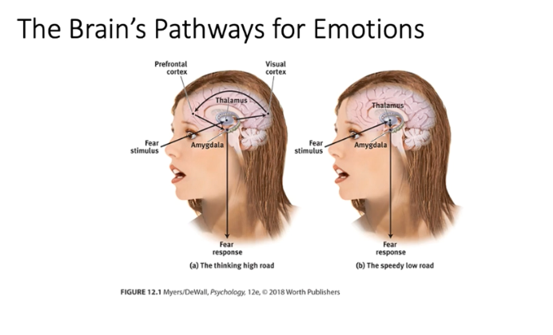
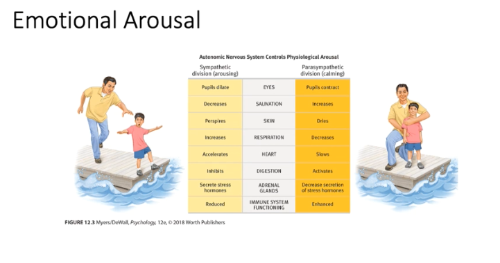
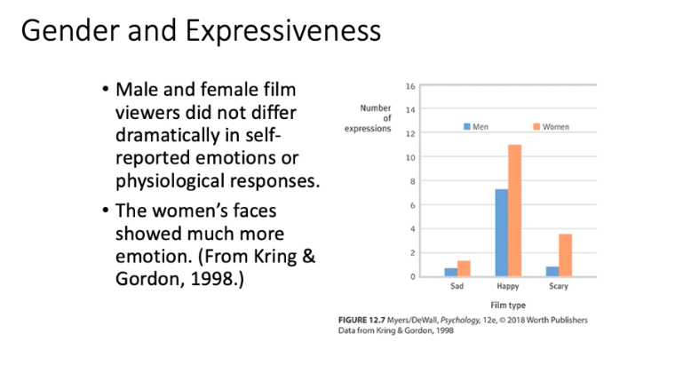
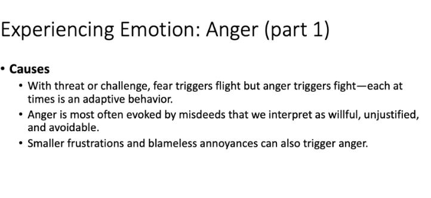

# PSYC 1215 Lecture 2 Notes

# [Motivation](motivation.md)

What motivates people? Why do people do things?

## Basic Motivational Concepts

>Extrinsic Motivation - Ex: Money

>Intrinsic Motivation - Ex: Satisfy Personal Goal

>Push - Something biological that influences us, like hunger

>Pull - Something that motivates us externally. Like personal experiences, thoughts, and culture

>Arousal - A heightened state in people. Increased heartrate, blood pressure, etc.

## Theories - Instincts and Evolutionary Psychology
[[perspectives for understanding motivated behaviors]]

## The Physiology of Hunger

Humans automatically regulate caloric intake through a homeostatic system to prevent energy deficits and maintain stable body wait. 

* Stomach contractions - DEBUNKED theory on why we feel hunger
* Blood sugar glucose regulation 
* Appetite hormones
* Set point - The plateau of weight. When your body falls below this weight your body may send signals to make you more hungry and lower your metabolic weight to try and get you back to this weight. 
* Basal metabolic rate - The amount of energy you need to keep your body alive. If you did nothing at all except lay in bed.

Glucose - The form of sugar that circulates in the blood and provides the major source of energy for body tissues. Triggers the feeling of hunger when low.

Hypothalamus and other brain structures

* Arcuate nucleus: Pumps out appetite suppressing hormones 

## Hormones That Increase/Decrease Appetite

* Ghrelin - secreted from the stomach and turns on hunger; Increase; Sends "I'm hungry".
* Orexin - increases appetite located in the brain
* Insulin - Pancreas; Controls blood glucose; Decrease;
* Leptin - Lower colon; Small intestine; Protein hormone that secreted by fat cells; Increase metabolism and decreases hunger.
* PYY - Peptide; Found in digestive tract. Sends signals to decrease appetite. Says "I'm not hungry".

# Taste

Body chemistry and environmental factors influence taste preferences.

Some things are biological though and are therefore pretty universal. Such as:
* Universal preferences for sweet and salty tastes
* Calming effects of serotonin boost from carbohydrates. A reason why people binge eat when anxious.

# Obesity

No place in the USA has obesity under 20 percent. 

**Genetics do influence body weight**, children's weights resemble those of their parents and identical twins have similar weight even when raised apart.

**Environment influences obesity.** Sleep loss contributes to a fall in leptin levels and a rise in ghrelin levels. IE you get more hungry when you sleep less.

There is social influence seen in the correlation among friends' weights. Increased food consumption and lower activity levels are seen worldwide in our society. We are encouraged to eat more by commercials and other cultural factors.

# Hormones and Sexual Behavior

Testosterone

* Most important male sex hormone
* Both males and females have it, but the additional testosterone in males stimulates the growth of the male sex organs during the fetal period, and the development of the male sex characteristics during puberty.

Estrogen Sex Hormones

* Estradiol is secreted in greater amounts by females than by males and contributes to female sex characteristics 
* In nonhuman female mammals, estrogen levels peak during ovulation, promoting sexual receptivity

[[The Sexual Response Cycle]]

## Sexual Motivation

Notice similarities to eating disorder/obesity factors

---

>Interesting Note: Anorexic people often have a high desire for control.

# The Benefits of Belonging

We have a natural tendency to want to be with other people or fit in with other people.

Social bonds and cooperation enhanced early ancestors' survivability,
* Combat was more successful
* Reproduction was strengthened 
* Foes were avoided

Having a social identity - feeling part of a group - boosts people's health and well being.

Isolation is a very severe punishment. Human's are still innately social beings.

* The need to belong affects thoughts, emotions, and behaviors.
* Feelings of love activate the brain reward and safety system. 
* Social isolation increases the risk for mental decline and poor health.

>Affiliation need: The need to build relationships and to feel a part of a group.

>Achievement Motivation: A desire for significant accomplishment; for mastery of skills or ideas; for control; and for attaining a high standard.
* Achievements are not distributed like a bell curve and require much more than raw ability
* [Grit](grit.md) matters. In psychology it involves passion and perseverance in the pursuit of long-term goals.

# Emotions

Positive emotions and negative emotions. 

Theories of emotion generally address two major questions:
    
1. Does physiological arousal come before or after emotional feelings?
2. How do feeling and cognition interact?

## Theories

**James-Lange Theory**: Arousal comes before emotions.
* Experience of emotion involves awareness of our physiological responses to emotion-arousing stimuli. You notice your heartrate is more so you start to feel the emotion tied to it and the situation.

**Cannon-Bard Theory**: Arousal and emotion happen at the same time.

* Emotion-arousing stimulus simultaneously triggers (1) physiological responses and (2) the subjective experience of emotion
* Human body responses run parallel to the cognitive responses rather than causing them.

**Schachter-Singer two-factor theory: Arousal + Label = Emotion**

* Emotions have two ingredients: physical arousal and cognitive appraisal.
* Arousal fuels emotion; cognition changes it.
* Emotional experience requires a conscious interpretation of arousal.
* >Spillover effect: Arousal spills over from one event to the next - influencing the response. For example riots at a soccer match. People are so invested and aroused from the soccer match it fuels their anger and rioting upon loss. Or the playing of war instruments fuelling battle.

**Zajonc, LeDoux, and Lazarus: emotion and the two-track brain**

* Zajonc
  * Sometimes emotional response takes a neural shortcut that bypasses the cortex and goes directly to the amygdala.
  * Some emotional responses involve no deliberate thinking.

* Lazarus
  * The brain processes much information without conscious awareness, but mental functioning still takes place.
  * Emotions arise when an event is appraised as harmless or dangerous.

The arousal component of emotion is regulated by the autonomic nervous system's sympathetic (arousing, heart rate going up) and parasympathetic (calming, heart rate going down) divisions.

In a crisis, the fight or flight response automatically mobilizes the body for action.

Arousal affects performance in different ways, depending on the task. Performance peas at lower levels of arousal for difficult tasks, and at higher levels for easy or well-learned tasks.

# Physiology of Emotions

> Where emotions are felt in the Brain

Different emotions have subtle indicators. Brain scans and EEGs reveal different brain circuits for different emotions. Depression and general negativity - right frontal lobe activity. Happiness, enthusiasm, feeling energized - left frontal lobe!

## Detecting Emotions in Others

Gestures, facial expressions, and voice tones are absent in written communication. In the absence of expressive emotion, ambiguity can occur. 

Emotion is not just verbal, it is also complimented by facial expression, hand gestures, proxemics (distance from speaker), paralanguage (tone, intonation)

Women tend to read emotional cues more easily and are empathetic. Express more emotion in their faces. 

Culturally, people attribute female emotionality to disposition and male emotionality to circumstance.

Cultures may share a facial language, but they differ in how much emotion they express. Those that encourage individuality tend to display visible emotions, those who do not tend to have less emotional display (Western vs Asian).

Izard isolated 10 basic/primary emotions that include physiology and expressive behavior. The rest are all a mix of these others that require more cognition.

1. Joy
2. Interest-Excitement
3. Surprise
4. Sadness
5. Anger
6. Disgust
7. Contempt
8. Fear
9. Shame
10. Guilt

> Two dimensions that help differentiate emotions
> 1. Positive vs Negative Valence (valence is like the feel of an emotion. Joy +, Anger -)
> 2. Low vs High Arousal

>Positive Psychology - Study of human functioning with the goals of discovering and promoting strengths and virtues that help individuals and communities to thrive. Research areas: Positive health, emotions, neuroscience, education.

[//begin]: # "Autogenerated link references for markdown compatibility"
[perspectives for understanding motivated behaviors]: perspectives-for-understanding-motivated-behaviors "Perspectives for Understanding Motivated Behaviors"
[The Sexual Response Cycle]: the-sexual-response-cycle "The Sexual Response Cycle"
[//end]: # "Autogenerated link references"