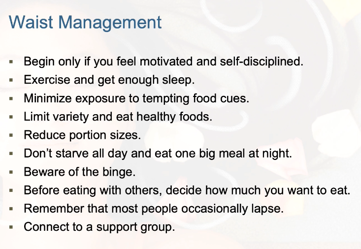
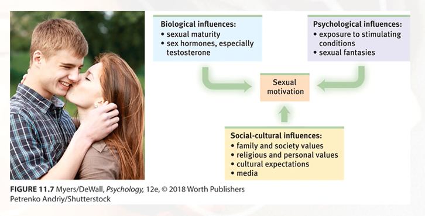

# PSYC 1215 Lecture 2 Notes

# [Motivation](motivation.md)

What motivates people? Why do people do things?

## Basic Motivational Concepts

>Extrinsic Motivation - Ex: Money

>Intrinsic Motivation - Ex: Satisfy Personal Goal

>Push - Something biological that influences us, like hunger

>Pull - Something that motivates us externally. Like personal experiences, thoughts, and culture

## Theories - Instincts and Evolutionary Psychology
[[perspectives for understanding motivated behaviors]]

## The Physiology of Hunger

Humans automatically regulate caloric intake through a homeostatic system to prevent energy deficits and maintain stable body wait. 

* Stomach contractions - DEBUNKED theory on why we feel hunger
* Blood sugar glucose regulation 
* Appetite hormones
* Set point - The plateau of weight. When your body falls below this weight your body may send signals to make you more hungry and lower your metabolic weight to try and get you back to this weight. 
* Basal metabolic rate - The amount of energy you need to keep your body alive. If you did nothing at all except lay in bed.

Glucose - The form of sugar that circulates in the blood and provides the major source of energy for body tissues. Triggers the feeling of hunger when low.

Hypothalamus and other brain structures

* Arcuate nucleus: Pumps out appetite suppressing hormones 

## Hormones That Increase/Decrease Appetite

* Ghrelin - secreted from the stomach and turns on hunger; Increase; Sends "I'm hungry".
* Orexin - increases appetite located in the brain
* Insulin - Pancreas; Controls blood glucose; Decrease;
* Leptin - Lower colon; Small intestine; Protein hormone that secreted by fat cells; Increase metabolism and decreases hunger.
* PYY - Peptide; Found in digestive tract. Sends signals to decrease appetite. Says "I'm not hungry".

# Taste

Body chemistry and environmental factors influence taste preferences.

Some things are biological though and are therefore pretty universal. Such as:
* Universal preferences for sweet and salty tastes
* Calming effects of serotonin boost from carbohydrates. A reason why people binge eat when anxious.

# Obesity

No place in the USA has obesity under 20 percent. 

**Genetics do influence body weight**, children's weights resemble those of their parents and identical twins have similar weight even when raised apart.

**Environment influences obesity.** Sleep loss contributes to a fall in leptin levels and a rise in ghrelin levels. IE you get more hungry when you sleep less.

There is social influence seen in the correlation among friends' weights. Increased food consumption and lower activity levels are seen worldwide in our society. We are encouraged to eat more by commercials and other cultural factors.

# Hormones and Sexual Behavior

Testosterone

* Most important male sex hormone
* Both males and females have it, but the additional testosterone in males stimulates the growth of the male sex organs during the fetal period, and the development of the male sex characteristics during puberty.

Estrogen Sex Hormones

* Estradiol is secreted in greater amounts by females than by males and contributes to female sex characteristics 
* In nonhuman female mammals, estrogen levels peak during ovulation, promoting sexual receptivity

[[The Sexual Response Cycle]]

## Sexual Motivation

Notice similarities to eating disorder/obesity factors

---

>Interesting Note: Anorexic people often have a high desire for control.

# The Benefits of Belonging

We have a natural tendency to want to be with other people or fit in with other people.

Social bonds and cooperation enhanced early ancestors' survivability,
* Combat was more successful
* Reproduction was strengthened 
* Foes were avoided

Having a social identity - feeling part of a group - boosts people's health and well being.

Isolation is a very severe punishment. Human's are still innately social beings.

* The need to belong affects thoughts, emotions, and behaviors.
* Feelings of love activate the brain reward and safety system. 
* Social isolation increases the risk for mental decline and poor health.

>Affiliation need: The need to build relationships and to feel a part of a group.

>Achievement Motivation: A desire for significant accomplishment; for mastery of skills or ideas; for control; and for attaining a high standard.
* Achievements are not distributed like a bell curve and require much more than raw ability
* [Grit](grit.md) matters. In psychology it involves passion and perseverance in the pursuit of long-term goals.

[//begin]: # "Autogenerated link references for markdown compatibility"
[perspectives for understanding motivated behaviors]: perspectives-for-understanding-motivated-behaviors "Perspectives for Understanding Motivated Behaviors"
[The Sexual Response Cycle]: the-sexual-response-cycle "The Sexual Response Cycle"
[//end]: # "Autogenerated link references"