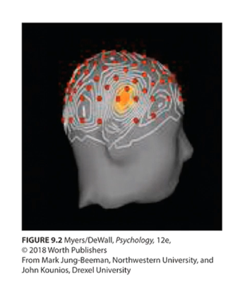

# PSYC 1215 Lecture 3 Notes

# Language and Thought

### Topics:

    What is thought? Why do we think? Where does it happen in the brain?

    Language (all kinds: verbal paralanguage, gesture, proxemics, etc)

    How does language influence thought? If you have more words for something in a language do you see that thing differently? Does not having names for colours alter your ability to see it?

## Thought

### Definitions:
* Cognition - All the mental activities associated with thinking, knowing, remembering, and communicating.
* Concept: A mental grouping of similar objects, events, ideas, and people.
* Prototype: A mental image or best example of a category. Matching new items to a prototype provides a quick and easy method for sorting items into categories. For example you may not know what a sweater is, but you know what a shirt is, so you figure out that a sweater must be prototypical of a shirt.
* Category boundaries begin to blur as movement from prototypes occurs. Where does one thing become another? Hard to say!

## Problem Solving Strategies - From most mental energy spent to least

* An [[algorithm]] - A methodical, logical rule, or procedure that guarantees a solution to a problem.
* A [[heuristic]] - a simpler strategy that is usually speedier than an algorithm but is also more error prone.
* [[Insight]] is not a strategy based solution, but rather a sudden flash of inspiration that solves a problem.

## Problem Solving Obstacles

* [[Confirmation Bias]] - Predisposes us to verify rather than challenge our hypothesis.

* [[Fixation]] - When you are so focused on one part of a problem that you are unable to see a different pespective that would solve the solution.

## The Aha! Moment

When we have a sudden burst of insight a burst of right temporal lobe EEG activity is noticed.

## Forming Good and Bad Decisions and Judgments 

* [[Intuition]] - An effortless, immediate, automatic feeling or thought, as contrasted with explicit, conscious reasoning.
* [[Representativeness Heuristic]] - Estimating the likelihood of events in terms of how well they seem to represent, or match, particular prototype; it may lead us to ignore other relevant information.
* [[Availability Heuristic]] - Estimating the likelihood of events based on their availability in memory; if instances come readily to mind (perhaps because of their vividness), we presume such events are common. 

[[Overconfidence]] - The tendency to believe one to be correct than is true

[[Belief Perseverance]] occurs when we cling to belief and ignore evidence that proves those beliefs wrong.

[[Framing]] sways decisions and judgments by influencing the way an issue is posed. It can also influence beneficial decisions.

[[Creativity]] - The ability to produce new and valuable ideas.

[[Robert Sternberg's Five Ingredients of Creativity]]

---

## Do Other Species Share Our Cognitive Skills?

Researches make inferences about other species' consciousness and intelligence based on behaviors.

Things we know:

* Other animals use concepts, numbers, and tools
* They transmit learning from one generation to the next
* They show insight, self-awareness, altruism, cooperation, and grief

---
# [[Language]] -- Click Here for More Info

Involves our spoken, written, or signed words and the ways we combine them to communicate meaning.

It is used to transmit civilization's knowledge from one generation to the next and connects humans.

---
# The Brain and Language

[[Aphasia]] - The loss or impairment of speech, usually cased by left hemisphere damage either to Broca's area (impairing speaking) or to Wernicke's area (impairing understanding)

[[Broca's Area]] - Controls language expression -- An area of the frontal lobe, usually in the left hemisphere that directs the muscle movements involved in speech.

[[Wernicke's Area]] - Controls language reception -- A brain area involved in language comprehension and expression; usually in the left temporal lobe.

---

[//begin]: # "Autogenerated link references for markdown compatibility"
[algorithm]: algorithm "Algorithm"
[heuristic]: heuristic "Heuristic"
[Insight]: insight "Insight"
[Confirmation Bias]: confirmation-bias "Confirmation Bias"
[Fixation]: fixation "Fixation"
[Intuition]: intuition "Intuition"
[Representativeness Heuristic]: representativeness-heuristic "Representativeness Heuristic"
[Availability Heuristic]: availability-heuristic "Availability Heuristic"
[Overconfidence]: overconfidence "Overconfidence"
[Belief Perseverance]: belief-perseverance "Belief Perseverance"
[Framing]: framing "Framing"
[Creativity]: creativity "Creativity"
[Robert Sternberg's Five Ingredients of Creativity]: robert-sternbergs-five-ingredients-of-creativity "Robert Sternberg's Five Ingredients of Creativity"
[Language]: language "Language"
[Aphasia]: aphasia "Aphasia"
[Broca's Area]: brocas-area "Broca's Area"
[Wernicke's Area]: wernickes-area "Wernicke's Area"
[//end]: # "Autogenerated link references"