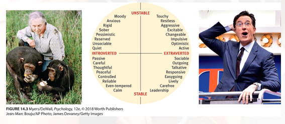

# Two Personality Dimensions

In extroverts the person is less aroused and needs to seek stimulation, while in the introvert the person is more aroused and therefore seeks to ,minimize stimulation. Both to reach homeostasis.