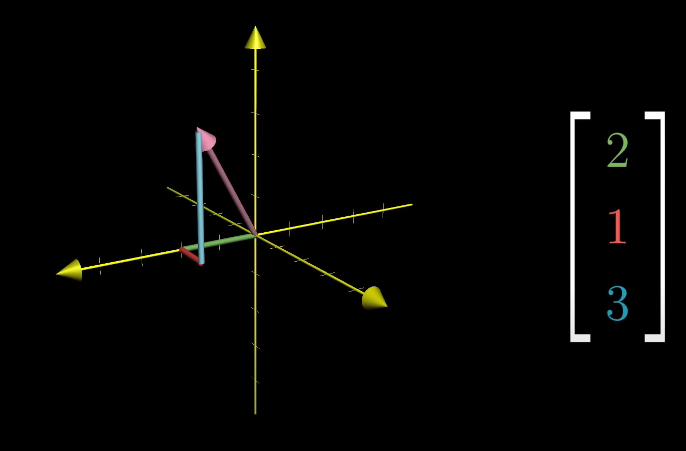

# Vectors

Physics Definition: 
>A vector is an arrow pointing in space. It has a length and a direction. Vectors on a flat plane are two dimensional. Vectors in our world are three dimensional, though for basic physics problems this won't come into play.

> Example: A car moving at 3.00 m/s to the left

CS Definition:
>A vector is an ordered list of numbers. EX: [Area, Cost]. Somewhat like an array with specific variables kind of like a class.

Math Definition:
>Arrows that you add together and add vectors together. We don't know much about it yet.

Think about an arrow in a coordinate system. In linear algebra vectors almost always start at the origin. 

